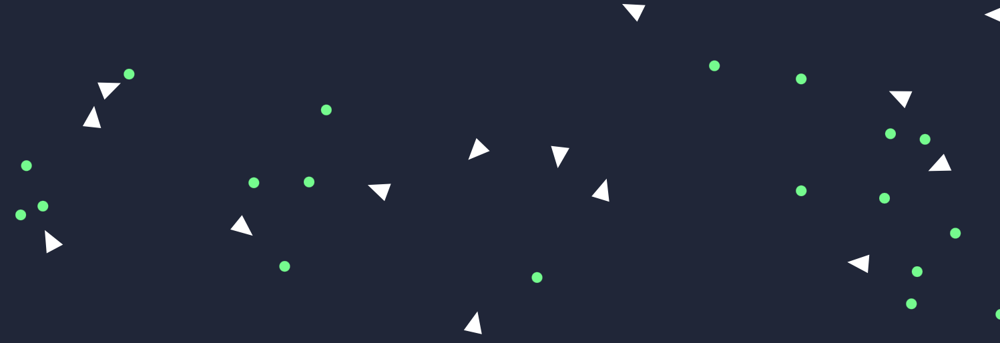

# Genetic-Birds-Simulator
A simulation of birds using neural networks and a genetic algorithm.



## About
The goal is to teach birds (triangles) how to catch food (circles) by using a learning mechanisms that simulates natural evolution.

### Motivation
This project is a kind of sequel to [MLP-Digits-Recognition](), an implementation of a neural network from scratch. This time, I used [this great tutorial](https://pwy.io/posts/learning-to-fly-pt1/) as a starting point, to train the neural network with a genetic algorithm, instead of backpropagation.

### Technical description
- The [`lib-neural-network`](libs/neural-network/src/lib.rs) library contains an implementation of a simple, non-optimized FFNN (Feed-Forward Neural Network).
- The [`lib-genetic-algorithm`](libs/genetic-algorithm/src/lib.rs) library implements a genetic algorithm, which selects, crossovers, and mutates individuals.
- The [`lib-simulation`](libs/simulation/src/lib.rs) back-end library holds the world, birds and food.
- The [`lib-simulation-wasm`](libs/simulation-wasm/src/lib.rs) middle-end library is a WebAssembly wrapper for `lib-simulation`.
- The [`npm` app](www) contains the front-end elements for the simulation and is responsible of displaying birds, food, and to handle user input.

The Genetic Algorithm is build to work with multiple selection, crossover, and mutation algorithms. The ones currently implemented are [Roulette Wheel Selection](https://en.wikipedia.org/wiki/Fitness_proportionate_selection), [Uniform Crossover](https://en.wikipedia.org/wiki/Crossover_(genetic_algorithm)), and [Gaussian Mutation](https://en.wikipedia.org/wiki/Gaussian_adaptation).


## Running the simulation
The simulation can run in any browser. To try it yourself, you will need:
- `rustc` and `cargo` installed, for the back-end code.
- [`wasm-pack`](https://rustwasm.github.io/wasm-pack/installer/), to compile Rust code into WebAssembly
- [`npm`](https://www.npmjs.com/get-npm) for the front-end simulation

In the `Genetic-Birds-Simulator` root folder, you can make sure that everything is working by running:
```console
$ cargo check && cargo test
```
Then, compile the Rust code to WebAssembly by running:
```console
$ cd libs/simulation-wasm
$ wasm-pack build --release
```
Finally, launch the front-end simulation by running:
```console
$ cd ../..
$ cd www
$ npm run start
```

If everything goes as planned, your terminal will display:
```console
...
｢wds｣: Project is running at http://localhost:8080/
...
｢wdm｣: Compiled successfully.
```

Enter `http://localhost:8080/` (or any other given address) in your favorite web browser, and the simulation should start.

## License
This work is licensed under the [CC-BY-NC-SA 4.0](https://creativecommons.org/licenses/by-nc-sa/4.0/) license.