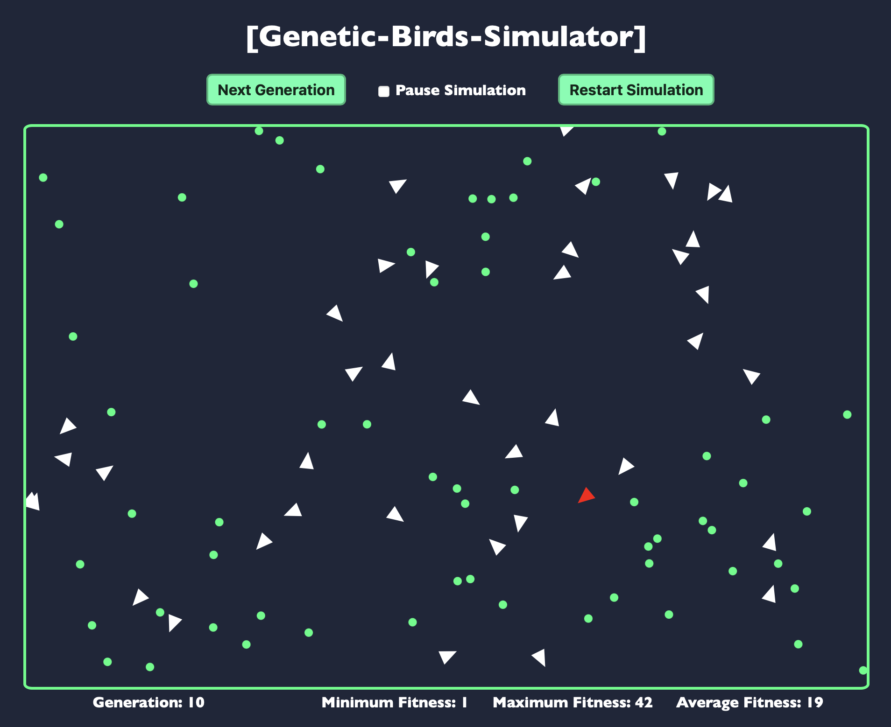

# Genetic-Birds-Simulator
A simulation of birds using neural networks and a genetic algorithm.


## About
The goal is to teach birds (triangles) how to catch food (circles) by using learning mechanisms that simulate natural evolution.

### Motivation
This project is a kind of sequel to [MLP-Digits-Recognition](https://github.com/Red-Rapious/MLP-Digits-Recognition), an implementation of a neural network from scratch. This time, I used [this great tutorial](https://pwy.io/posts/learning-to-fly-pt1/) as a starting point, to train the neural network with a genetic algorithm, instead of backpropagation.

### Technical description
- The [`lib-neural-network`](libs/neural-network/src/lib.rs) library contains an implementation of a simple, non-optimized FFNN (Feed-Forward Neural Network).
- The [`lib-genetic-algorithm`](libs/genetic-algorithm/src/lib.rs) library implements a genetic algorithm, which selects, crossovers, and mutates individuals.
- The [`lib-simulation`](libs/simulation/src/lib.rs) back-end library holds the world, birds and food.
- The [`lib-simulation-wasm`](libs/simulation-wasm/src/lib.rs) middle-end library is a WebAssembly wrapper for `lib-simulation`.
- The [`npm` app](www) contains the front-end elements for the simulation and is responsible of displaying birds, food, and to handle user input.

The Genetic Algorithm is build to work with multiple selection, crossover, and mutation algorithms. The ones currently implemented are [Roulette Wheel Selection](https://en.wikipedia.org/wiki/Fitness_proportionate_selection), [Uniform Crossover](https://en.wikipedia.org/wiki/Crossover_(genetic_algorithm)), and [Gaussian Mutation](https://en.wikipedia.org/wiki/Gaussian_adaptation).


## Running the simulation



The simulation can run in any browser. To try it yourself, you will need:
- `rustc` and `cargo` installed, for the back-end code.
- [`wasm-pack`](https://rustwasm.github.io/wasm-pack/installer/), to compile Rust code into WebAssembly
- [`npm`](https://www.npmjs.com/get-npm) for the front-end simulation

> __Note:__ some packages used seem to conflict with latest `npm` versions. If you encounter any issues, try to change `npm` version using `npm install npm@9.5.0 -g`, and to add the following node option: `export NODE_OPTIONS=--openssl-legacy-provider`.

In the `Genetic-Birds-Simulator` root folder, you can make sure that everything is working by running:
```console
$ cargo check && cargo test
```
Then, compile the Rust code to WebAssembly by running:
```console
$ cd libs/simulation-wasm
$ wasm-pack build --release
```
Finally, launch the front-end simulation by running:
```console
$ cd ../..
$ cd www
$ npm run start
```

If everything goes as planned, your terminal will display:
```console
...
｢wds｣: Project is running at http://localhost:8080/
...
｢wdm｣: Compiled successfully.
```

Enter `http://localhost:8080/` (or any other given address) in your favorite web browser, and the simulation should start.

## Parameters
You can play with the parameters of the simulation. They are defined as constants in [`lib-simulation`](libs/simulation/src). The [`lib.rs`](libs/simulation/src/lib.rs) file contains general parameters, and the [`eye.rs`]((libs/simulation/src/eye.rs)) file contains constants that define the FOV (Field of View) of the birds.

[`lib.rs`](libs/simulation/src/lib.rs) includes:
- Minimum and maximum speed of the birds.
- Maximum change of speed and rotation that the brain can ask for, in one step.
- The `GENERATION_LENGTH`, number of steps between two evolutions.
- Gaussian mutation parameters: the chance of mutation, and coefficient of change.
- The number of birds and foods in the simulation.

[`eye.rs`](libs/simulation/src/eye.rs) includes:
- `FOV_RANGE`, the maximum distance that the eye can see.
- `FOV_ANGLE`, the angle that the eye covers.
- `CELLS`, the number of subdivisions of the FOV. The number of cells is also the number of neurons in the input layer of the brain's neural network.

One last parameter is available in the [`index.js` file](www/index.js) of the front-end simulation, and is called `STEPS_PER_FRAME`. By default, your web browser will try to run the program at roughly 60 frames per second; hence, if `STEPS_PER_FRAME = 1`, only 60 steps will be simulated per seconds. To speed up this process, use, for example, `STEPS_PER_FRAME = 10`, which will try to compute 600 steps per second.

## License
This work is licensed under the [CC-BY-NC-SA 4.0](https://creativecommons.org/licenses/by-nc-sa/4.0/) license.